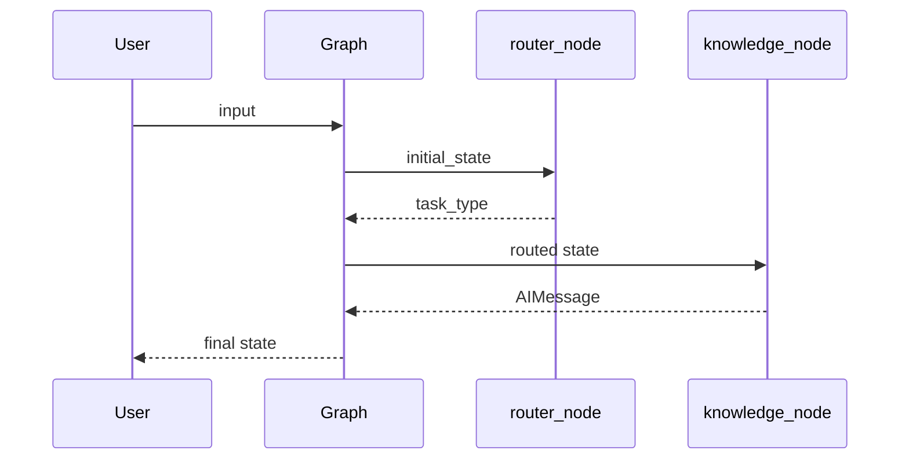

# 第 1 周请求执行追踪

- 日期：
- 输入：`bind_tools 有什么作用？`
- 是否调用外部模型：否
- request/thread 标识：

## 时序图

## 状态变化

| 步骤 | 节点/边 | 读取字段 | 写入字段 | 分支理由 | 潜在失败 |
| ---: | --- | --- | --- | --- | --- |
| 1 | START | | | | |
| 2 | router_node | | | | |
| 3 | conditional edge | | | | |
| 4 | knowledge_node | | | | |
| 5 | END | | | | |

## 最终检查

- 初始消息数：
- 最终消息数：
- 最终 `task_type`：
- 最终 `llm_calls`：
- 走过的节点：

## 可观测性缺口

1.
2.
3.

## 不应记录的数据

- API Key；
-
-

## 我的解释

为什么选择该路由：

如果失败，最可能在哪里：

哪个测试可以保护这条路径：
